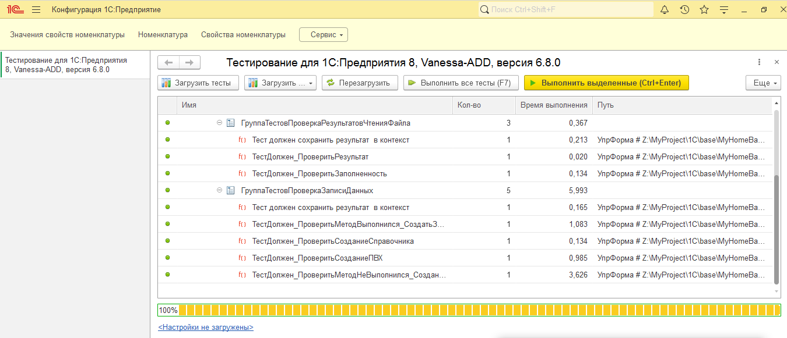
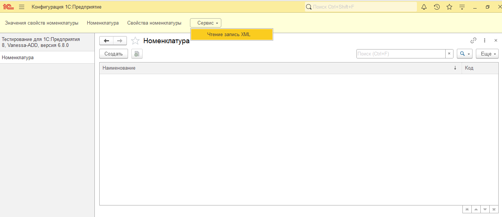
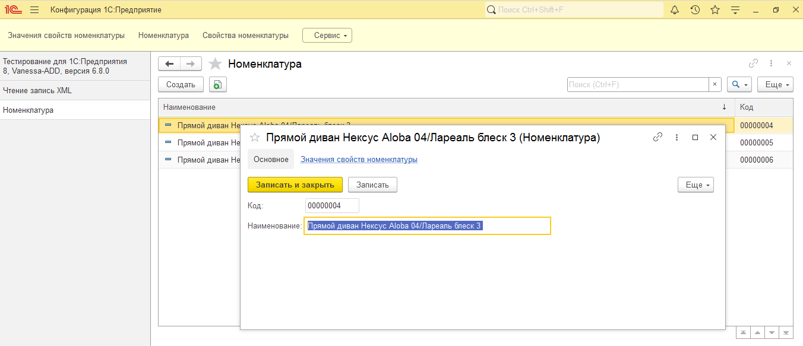
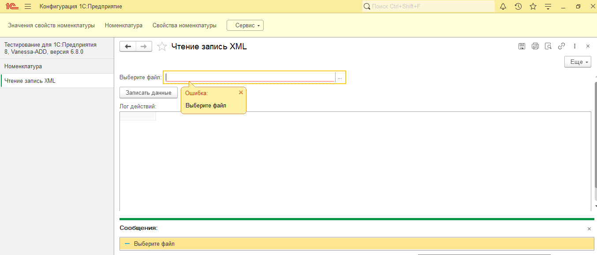
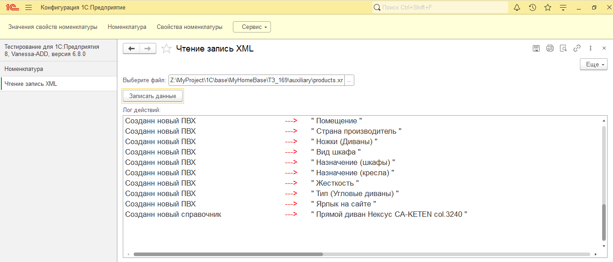
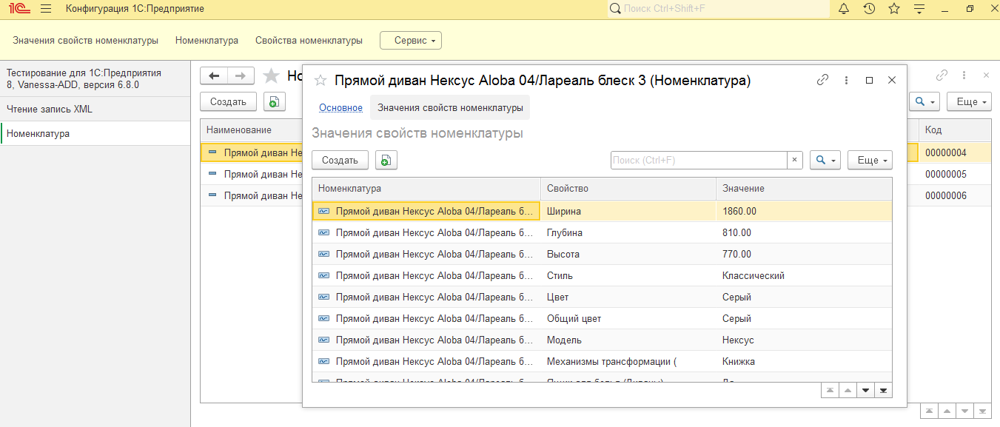

## Описание проекта  

### Тестовое задане включает в себя проект конфигурации  программы EDT (Enterprise Development Tools), а так же минимальные тесты для проверки работоспосбности кода [Tests](/tests/EDT.tests/)

&nbsp;  
&nbsp;  
&nbsp;  
&nbsp; 

## Тестовое задание  

Необходимо создать конфигурацию с:
- справочник Номенклатура
- ПВХ Свойства номенклатуры
- РС Значения свойств объектов, и сделать отображение свойств – значений в справочнике номенклатура. 
- Создать обработку которая будет из XML файла подгружать свойства - значения в РС. (В файла нужно искать номенклатуру по наименованию если ее нет, то создавать, искать свойства по ИД если их не, так же создавать и присваивать ИД)
*В файле присутствуют лишние параметры по номенклатуре на которые не стоит обращать внимание. Нам нужны только (Наименование номенклатуры, наименование свойства, ид свойства, значения)  

&nbsp;  
&nbsp;  
&nbsp;  
&nbsp; 

## Screenshots

  </figure>
    <figure class="image-wrapper">
    
    <figcaption class="image-caption">Тесты</figcaption>
  </figure>
  <figure class="image-wrapper">
    
    <figcaption class="image-caption">Интерфейс</figcaption>
    </figure>
    <figure class="image-wrapper">
    
    <figcaption class="image-caption">Номенклатура</figcaption>
  </figure>
  </figure>
    <figure class="image-wrapper">
    
    <figcaption class="image-caption">Обработка</figcaption>
  </figure>
  </figure>
    <figure class="image-wrapper">
    
    <figcaption class="image-caption">Лог</figcaption>
  </figure>
  </figure>
    <figure class="image-wrapper">
    
    <figcaption class="image-caption">ЗаписиРегистраПоНоменклатуре</figcaption>
  </figure>

